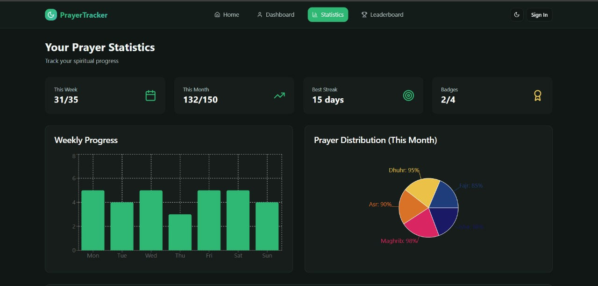

# Prayer Tracker 🕌

A modern web application to help Muslims **track daily, weekly, and monthly prayers** with progress statistics, achievements, and motivational UI.  
The project is designed to encourage consistency and community interaction.  

🚀 Live Demo: [prayertracker-psi.vercel.app](https://prayertracker-psi.vercel.app/)

---

## ✨ Features
- 📊 **Prayer Statistics** (daily, weekly, monthly tracking)
- 🏆 **Achievements & Badges System**
- 🔐 **Authentication** (login/register with JWT token)
- 📱 **Responsive Design** (works on desktop & mobile)
- 🌙 **Dark Mode Ready**
- ⚡ **Fast Performance** thanks to Vite + React

---

## 🛠️ Tech Stack

### Frontend
- **React 18** – component-based UI  
- **Vite** – lightning-fast build tool  
- **TypeScript** – static typing and better developer experience  
- **Tailwind CSS** – utility-first responsive styling  
- **shadcn/ui** – modern, accessible UI components  
- **Lucide Icons** – clean SVG icon set  
- **Recharts** – charts & graphs for prayer statistics  
- **React Router DOM** – navigation and protected routes  
- **Context API / Hooks** – state management  

### Backend (Optional / API Integration)
- **Django Rest Framework (DRF)** – API for prayers, users, badges  
- **JWT Authentication** – secure login & token-based authentication  

### Deployment & Tools
- **Vercel** – frontend hosting & CI/CD  
- **Git & GitHub** – version control and collaboration  
- **.env Environment Variables** – API base URL and secrets  
- **Node.js + npm** – package management and development  

---

## ⚙️ Getting Started (Local Development)

### Prerequisites
- [Node.js](https://nodejs.org/) (v18+ recommended)  
- [npm](https://www.npmjs.com/) (comes with Node.js)  

### Setup

1. **Clone the repository**
   ```bash
   git clone https://github.com/abdelfatah-dev/PrayerTracker.git

2. **Navigate to the project folder**
    cd PrayerTracker

3. **Install dependencies**
    npm install

4. **Start the development server**
    Start the development server
    Open http://localhost:5173 in your browser.


## 🌐 Deployment

The project is deployed on Vercel.

Every push to main branch automatically triggers a new deployment.

Live URL: prayertracker-psi.vercel.app


## 📌 Notes

node_modules/ and build artifacts are excluded via .gitignore.

API requests are configured inside src/services/api.ts.

Make sure to update the BASE_URL in api.ts with your backend server address.

You can connect a custom domain via Vercel settings.


📸 Preview




✍️ Developed with ❤️ by Abdelfatah